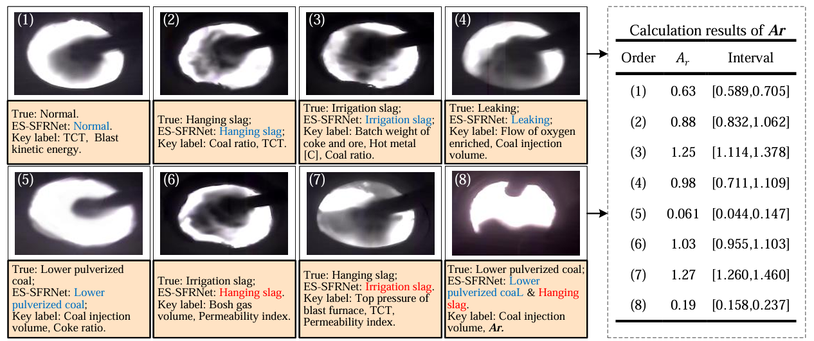
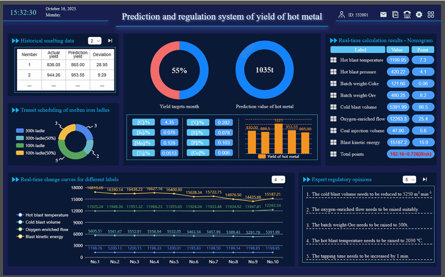
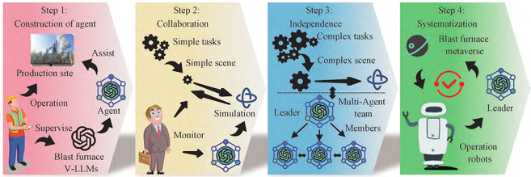

<h1 id="-publications">📝 Publications📝 论文发表</h1>

<h2>🐳 Intelligent application of blast furnace🐳 高炉智能化应用</h2>

EAAI 2025

[A novel anomaly detection and classification algorithm for application intuyere images of blast furnace](https://doi.org/10.1016/j.engappai.2024.109558) \\
**Yifan Duan**, Xiaojie Liu, Ran Liu, Xin Li, Hongwei Li, Hongyang Li, Yanqin Sun, Yujie Zhang, Qing Lv

[**Project**](https://github.com/hblg-YifanDuan/Tuyere_ImageRecognition) <strong></strong>

- ES-SFRNet is China’s first deep learning framework equipped with an adaptive feature extraction mechanism tailored for blast furnace tuyere recognition.
- **Academic Impact**: This framework integrates image edge detection information with expert experience and innovatively introduces additional metrics to assist recognition. Compared with existing research, ES-SFRNet boasts promising prospects for popularization and application. It has been promoted on domestic technical platforms including [CSDN](https://blog.csdn.net/IT_XiaoFan_/article/details/143610581) and [Zhihu](https://zhuanlan.zhihu.com/p/5642516506), accumulating more than 2,000 total views..
- **Industry Impact**: ES-SFRNet has been deployed on-site at blast furnace production facilities of partnered iron and steel enterprises, enabling recognition and inspection of over seven tuyere operating states.

- ES-SFRNet 是中国首个具备自适应特征提取机制的适用于高炉风口识别的深度学习框架。
- **学术影响**：利用图像边缘检测信息并融合专家经验，创新了额外的指标辅助识别，与相关研究相比，ES-SFRNet具备广阔的推广应用空间，并在国内相关技术平台进行推广，如[CSDN](https://blog.csdn.net/IT_XiaoFan_/article/details/143610581)、[知乎](https://zhuanlan.zhihu.com/p/5642516506)，等，已收获超2000次阅读。
- **工业影响**：ES-SFRNet 已被部署于相关的合作钢铁企业高炉生产现场，支持 7 种以上风口状态的识别与检测。

ISRI 2025

[A novel intelligent optimization and guidance method for blastfurnace oriented to increasing yield of hot metal ](https://link.springer.com/article/10.1007/s42243-025-01600-7) \\
**Yifan Duan**, Ran Liu, Xiaojie Liu, Hongwei Li, Xin Li, Hongyang Li, Jun Zhao, Haonan Wang, Qing Lv

[**Project**](https://link.springer.com/article/10.1007/s42243-025-01600-7) <strong></strong>

  - Through theoretical analysis and data mining, this work designs a deep learning architecture to efficiently and accurately realize the continuous prediction and regulation of single-iron secondary iron output of blast furnace, and solves the problem of metal iron waste caused by unknown pig iron output. To a certain extent, it alleviates the heat loss of iron ladle transportation, which is conducive to promoting the intelligent level of blast furnace in China and reducing costs and increasing efficiency..

  - 该项工作通过理论分析和数据挖掘，设计深度学习架构高效并准确实现了对高炉单铁次生铁产量的连续预测和调控，解决由于生铁产量未知导致的金属铁浪费问题，一定程度上缓解了铁水包运输的热量损失，有利于推动我国高炉智能化水平与降本增效。

<h2>🐳 Blast furnace intelligent theory innovation🐳 高炉智能化理论创新</h2>

Iron & Steel 2025

[Reconstructing paradigm of blast furnace ironmaking intelligence driven by large language models: evolution,integration, and prospects](https://kns.cnki.net/kcms2/article/abstract?v=8usEsk9d4Ulq1BlK8ZaSHbsw9VSF1XtiFKid9OJZmeYgLit1bBiCL2n0JNzDj28jzgBfkvCqTFI7Q1peaK_TJlvsBN0pLSSX5FO662NXoyfZwEGH-16S1B4c6MSZXitu9dJ6tnlKqInofTHUZbzQpxduzkxQwy_qqiSxRjvs4vmKRAHIegYPdg==&uniplatform=NZKPT&language=CHS) \\
Ran Liu, **Yifan Duan**, Xiaojie Liu, Qing Lv

[**Project**](https://kns.cnki.net/kcms2/article/abstract?v=8usEsk9d4Ulq1BlK8ZaSHbsw9VSF1XtiFKid9OJZmeYgLit1bBiCL2n0JNzDj28jzgBfkvCqTFI7Q1peaK_TJlvsBN0pLSSX5FO662NXoyfZwEGH-16S1B4c6MSZXitu9dJ6tnlKqInofTHUZbzQpxduzkxQwy_qqiSxRjvs4vmKRAHIegYPdg==&uniplatform=NZKPT&language=CHS) 

  - Combined with the development status of China 's iron and steel vertical large model, the construction and application route of China 's blast furnace ironmaking vertical large model is proposed for the first time, and three feasible new paradigms of blast furnace ironmaking intelligence in the future are explored.
  - The new concept of ' blast furnace portrait ' is proposed for the first time, which provides theoretical guidance for the deep application of vertical large model technology in intelligent blast furnace ironmaking.

  - 结合中国钢铁垂直大模型发展现状，首次提出中国高炉炼铁垂直大模型的构建与应用路线，并探究了未来 3 种可行的高炉炼铁智能化新范式。
  - 首次提出“高炉画像”新概念，为垂直大模型技术在高炉炼铁智能化的深度应用提供理论指导。

[//]: # (- `NeurIPS 2024` [MimicTalk: Mimicking a Personalized and Expressive 3D Talking Face in Minutes]&#40;https://proceedings.neurips.cc/paper_files/paper/2024/hash/034cd49870f1cc253fc08686049ae7eb-Abstract-Conference.html&#41;, Zhenhui Ye, Tianyun Zhong, **Yi Ren**, et al.)

[//]: # (- `ACM-MM 2025` [UniTalker: Conversational Speech-Visual Synthesis]&#40;https://dl.acm.org/doi/abs/10.1145/3746027.3755502&#41;, Yifan Hu, Rui Liu, **Yi Ren**, Xiang Yin, Haizhou Li)

[//]: # (- `arXiv 2025` [HumanDiT: Pose-guided Diffusion Transformer for Long-form Human Motion Video Generation]&#40;https://arxiv.org/abs/2502.04847&#41;, Qijun Gan, **Yi Ren**, et al.)

[//]: # (- `arXiv 2025` [InfinityHuman: Towards Long-Term Audio-Driven Human]&#40;https://arxiv.org/abs/2508.20210&#41;, Xinran Li, Peiqi Xie, **Yi Ren**, et al.)

[//]: # (- `ICLR 2023` [GeneFace: Generalized and High-Fidelity Audio-Driven 3D Talking Face Synthesis]&#40;https://openreview.net/forum?id=YfwMIDhPccD&#41;, Zhenhui Ye, Ziyue Jiang, **Yi Ren**, et al.)

[//]: # (- `AAAI 2024` [AMD: Autoregressive Motion Diffusion]&#40;https://arxiv.org/abs/2305.09381&#41;, Bo Han, Hao Peng, Minjing Dong, **Yi Ren**, et al.)

[//]: # (- ``AAAI 2022`` [Parallel and High-Fidelity Text-to-Lip Generation]&#40;https://arxiv.org/abs/2107.06831&#41;, Jinglin Liu, Zhiying Zhu, **Yi Ren**, et al. \| [![]&#40;https://img.shields.io/github/stars/Dianezzy/ParaLip?style=social&label=ParaLip Stars&#41;]&#40;https://github.com/Dianezzy/ParaLip&#41;)

[//]: # (- ``AAAI 2022`` [Flow-based Unconstrained Lip to Speech Generation]&#40;https://ojs.aaai.org/index.php/AAAI/article/view/19966&#41;, Jinzheng He, Zhou Zhao, **Yi Ren**, et al.)

[//]: # (- ``ACM-MM 2020`` [FastLR: Non-Autoregressive Lipreading Model with Integrate-and-Fire]&#40;https://dl.acm.org/doi/10.1145/3394171.3413740&#41;, Jinglin Liu, **Yi Ren**, et al.)
